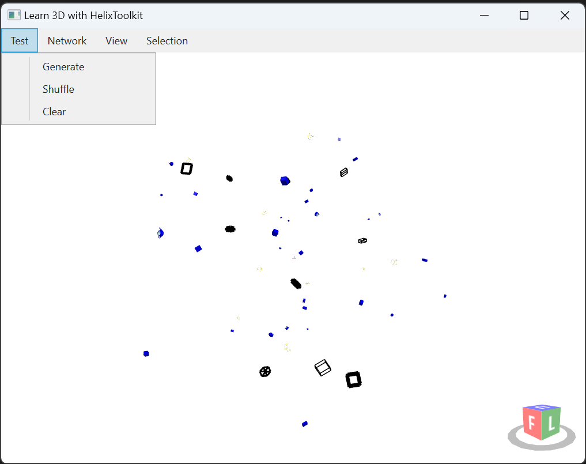

## Learn WPF 3D with HelixToolkit

Create a set of built-in 3D models then apply following transforms to each model:

- a random translation within a rectangular boundary,
- a random scale transform, and
- a random rotation transform

## Actions in the Test Menu

- Generate - recreate a different set of of 3D models with random transforms.
- Shuffle - apply a different random transform to the existing set of 3D models.
- Clear - delete all the 3D models.

## Actions in the View Menu

- Zoom Extents - change camera setting to ensure all the models are within view.

## Action in the Selection Menu

- Point Selection - toggle the feature to enable selection of the model with the left mouse button.
- Rectangle Selection - toggle the feature to enable selection of the model(s) with a rectangle drawn with the left mouse button.
    - When rectangle is drawn from left to right, model(s) are selected when they are inside the rectangle.
    - When rectangle is drawn from right to left, model(s) are selected when they touched with the rectangle.

A new random color is assigned to the model when they are selected. 

## HelixToolkit Default Navigation with Keyboard

- Ctrl+Shift-E - Zoom extent
- Ctrl+U - Up view
- Ctrl+D - Down view
- Ctrl+L - Left view
- Ctrl+R - Right view
- Ctrl+F - Front view
- Ctrl+B - Back view
- {Arrow key} - rotate view
- Shift+{Arrow key} - pan view

## HelixToolkit Default Navigation with Mouse

- {Right button down} - rotate view
- {Middle button down} - pan view
- {Right button double-click} - re-center view and point-of-rotation on the nearby model
- {Left click on view cube} - change view
- {Left double-click on view cube} - change to opposite view
- {Scroll wheel} - Zooming

## An Example of Real-World Application

[Raceway Network in 3D View](./Raceway3D.md)

