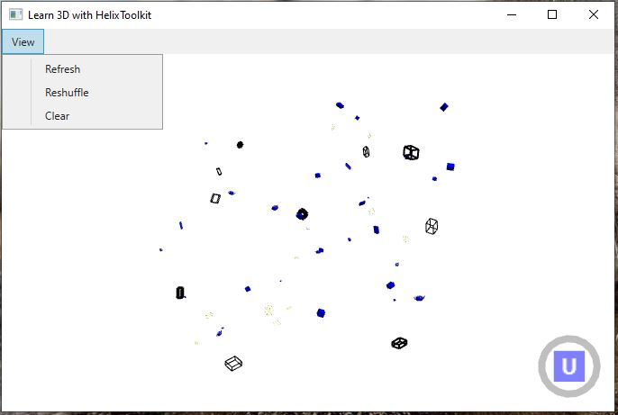

## Learn WPF 3D with HelixToolkit

Create a set of built-in 3D models then apply following transforms to each model:

- a random translation within a rectangular boundary,
- a random scale transform, and
- a random rotation transform

## Select a 3D Model in the Viewport

Double-click with the left mouse button on a model will change it to a different random color.

## Actions in the View Menu

- Refresh - recreate a different set of of 3D models with random transforms.
- Reshuffle - apply a different random transform on the existing set of 3D models.
- Clear - delete all the 3D models.

## HelixToolkit Default Navigation with Keyboard

- Ctrl+Shift-E - Zoom extent
- Ctrl+U - Up view
- Ctrl+D - Down view
- Ctrl+L - Left view
- Ctrl+R - Right view
- Ctrl+F - Front view
- Ctrl+B - Back view
- {Arrow key} - rotate view
- Shift+{Arrow key} - pan view

## HelixToolkit Default Navigation with Mouse

- {Right button down} - rotate view
- {Middle button down} - pan view
- {Right button double-click} - re-center view and point-of-rotation on the nearby model
- {Left click on view cube} - change view
- {Left double-click on view cube} - change to opposite view
- {Scroll wheel} - Zooming