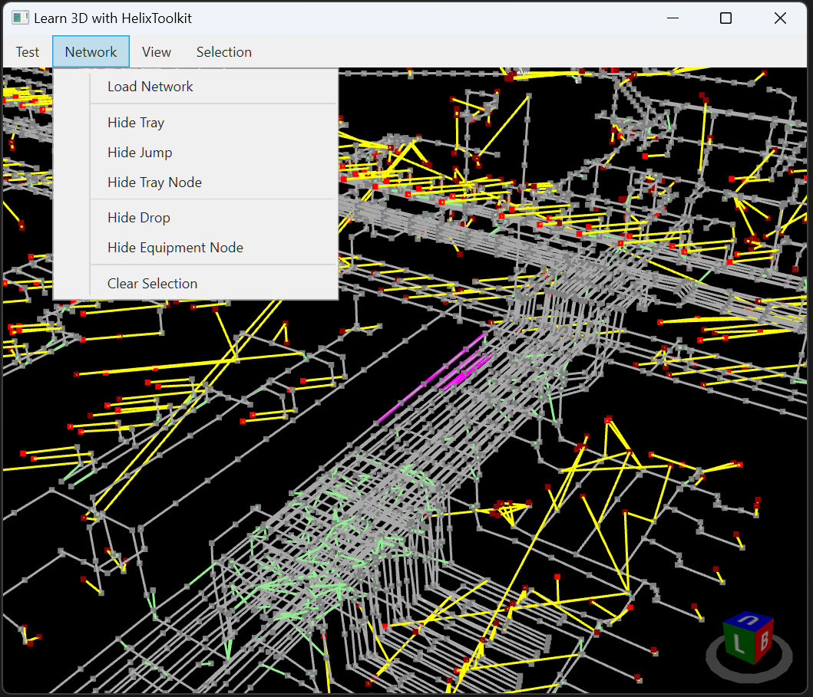

## Raceway Network in 3D View

In engineering, we need to route cables between two equipments along the cable tray network. Designer typically models the equipment and the cable trays in a plant design CAD software like Hexagon Smart 3D or AVEVA E3D. The models are then exported as lines and nodes with 3D coordinates for the nodes. Such data now can be plotted as lines and points to provide a represented view of the cable tray network and the highlighted routes of cables between equipments along the cable tray network.

## Type of Lines

- Tray - white line, which is a physical tray to be installed
- Jump - green line, which defines an abstract path between physical trays even when these trays are not physically connected
- Drop - yellow line, which defines an abstract path where cables between from/to equipments can enter/leave the physical trays
- Selection - magenta line, which highlight selected raceway using left mouse click

## Type of Points

- Tray - white point, which defines a connection between trays and where cables can enter/leave the tray
- Equipment - red point, which defines the location of an equipment

## Manage Layers

- Hide Tray - toggle the display of Tray layer
- Hide Jump - toggle the display of Jump layer
- Hide Tray Node - toggle the display of Tray Node layer
- Hide Drop - toggle the display of Drop layer
- Hide Equipment Node - toggle the display of Equipment Node layer